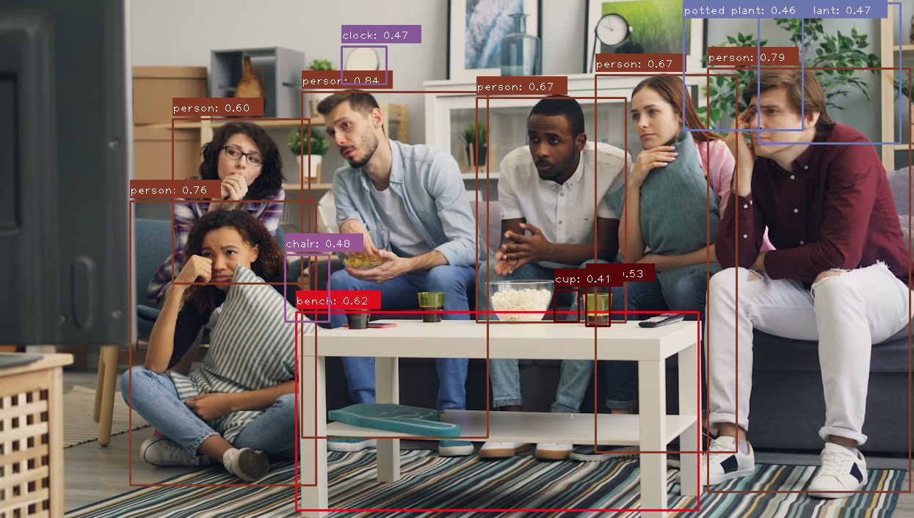

# Object Detection Using TensorFlow and OpenCV
This project demonstrates an object detection application that uses a TensorFlow pre-trained MobileNet SSD model to detect objects in images. The application processes images, detects objects, and draws bounding boxes with class labels and confidence scores using OpenCV.

## Project Structure
main.py: The main script that loads the TensorFlow model and performs object detection on input images. OpenCV is used for displaying the results with bounding boxes and labels.
models/: Contains the pre-trained TensorFlow MobileNet SSD model (saved_model.pb) and model variables.
roompeople.jpeg: A sample image used to test the detection system.
README.md: Documentation for the project (this file).

## Features
Detects objects in images using a pre-trained MobileNet SSD model.
Draws bounding boxes around detected objects with dynamic colors.
Displays the class name and confidence score for each detected object.
Uses Non-Maximum Suppression (NMS) to filter overlapping bounding boxes for clarity.
## Install the required Python packages:
To run the project, you need to install the required Python libraries. Open a terminal and type the following:
pip install tensorflow opencv-python numpy
Make sure the models/ folder exists in the project root, containing the TensorFlow model files (saved_model.pb and variables/).

## Run the application:
To run the object detection application, open the terminal in the project root and execute:
python main.py
The program will process the image (roompeople.jpeg) and display it with detected objects, bounding boxes, and labels.

## How It Works
Image Loading: The input image is loaded and preprocessed using OpenCV.
Object Detection: The TensorFlow model (MobileNet SSD) processes the image and detects objects, returning bounding boxes, class labels, and confidence scores.
Bounding Boxes and Labels: OpenCV is used to draw bounding boxes with unique colors and display the class name and confidence score for each detected object.
Non-Maximum Suppression (NMS): This is applied to remove redundant overlapping boxes, improving the clarity of the output.
Dynamic Color Assignment: A unique color is assigned to each detected object using random generation for visual distinction.
## Customization
Change the Input Image: To test with another image, replace roompeople.jpeg with any image of your choice and update the image_path variable in main.py.
Adjust Confidence Threshold: You can modify the min_confidence variable in main.py to change the confidence level at which objects are displayed.
Example Output
After running the script, the application will display an image with detected objects highlighted by bounding boxes, class names, and confidence scores.

